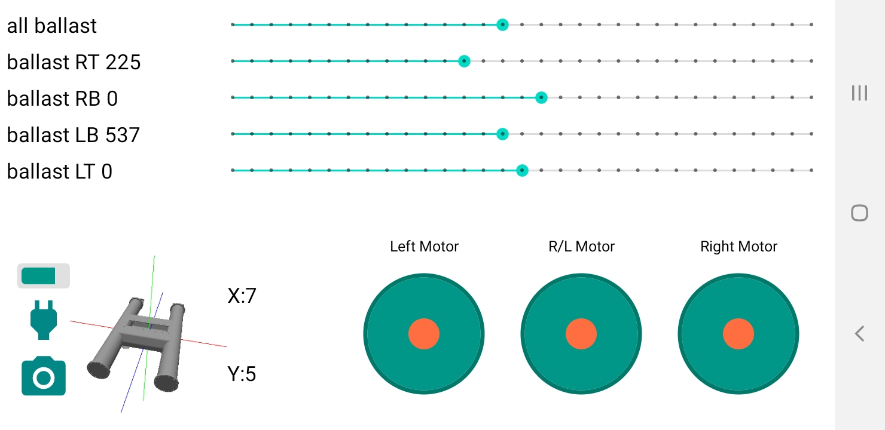

# Submarine Project

This is an Android app designed to control a submarine using an Arduino/NodeMCU device. The app follows the MVVM (Model-View-ViewModel) architecture and implements the Clean Architecture pattern.

## Features

- Display the current index of ballast
- Allow the user to change the index of ballast
- Control the movement of the submarine in all direction
- Control each motor separately
- Display the position of the submarine using data from a gyroscope sensor, represented by a 3D object
- Turn on/off the Arduino/NodeMCU device
- Display the battery level
- Open the camera on the submarine

## Screenshots

## How it works

The Arduino/NodeMCU device is connected to a gyroscope sensor and is responsible for collecting data from it. The device then sends this data to Firebase, where the Android app can retrieve it. The app communicates with the device using a serial connection, as the Arduino does not have built-in WiFi capabilities.

## Contributions

Contributions are always welcome! If you would like to contribute to this project, please make a pull request.
